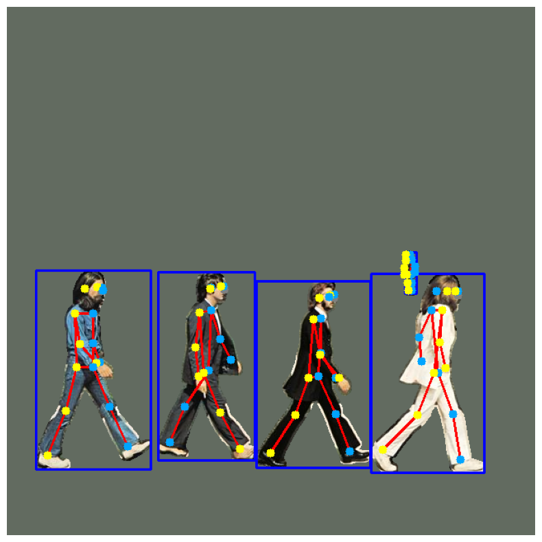

# SkeletonPose

SkeletonPoseは、画像内の人物の姿勢推定を行うためのツールキットです。このプロジェクトは、物体検出、セグメンテーション、キーポイント検出などのタスクを統合し、人物の姿勢を推定するための簡単な方法を提供します。

<p align="center">
    
</p>

**画像**: 姿勢推定のデモ画像（背景処理：MEAN_COLOR_BACKGROUND）

## 特徴
- 姿勢推定のための簡単なAPIを提供します。
- 物体検出モデル、セグメンテーションモデル、姿勢推定モデルを統合して使用できます。
- 背景処理方法（RAW、SHUFFLE_BACKGROUND、SHUFFLED_PIXEL、MEAN_COLOR_BACKGROUND）をカスタマイズできます。

## インストール
以下のコマンドを使用してSkeletonPoseをインストールします。

```bash
pip install -e .
```

## モデルのダウンロード
BOXリンク
- https://tus.box.com/s/50959ctzx3rftqthnq6aq0orqn2cdj6r